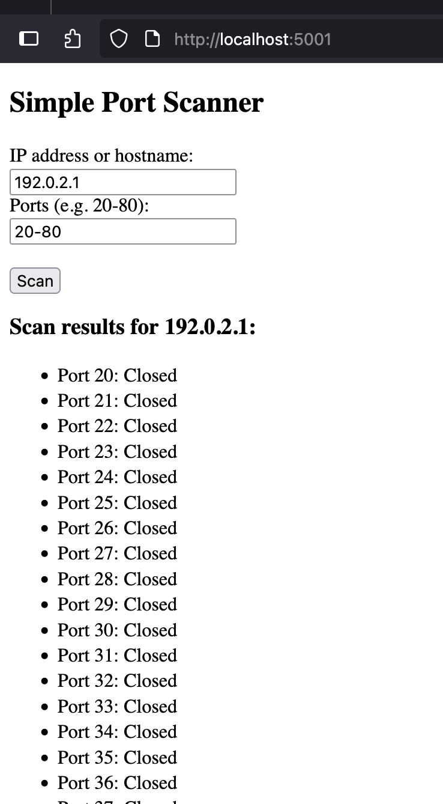
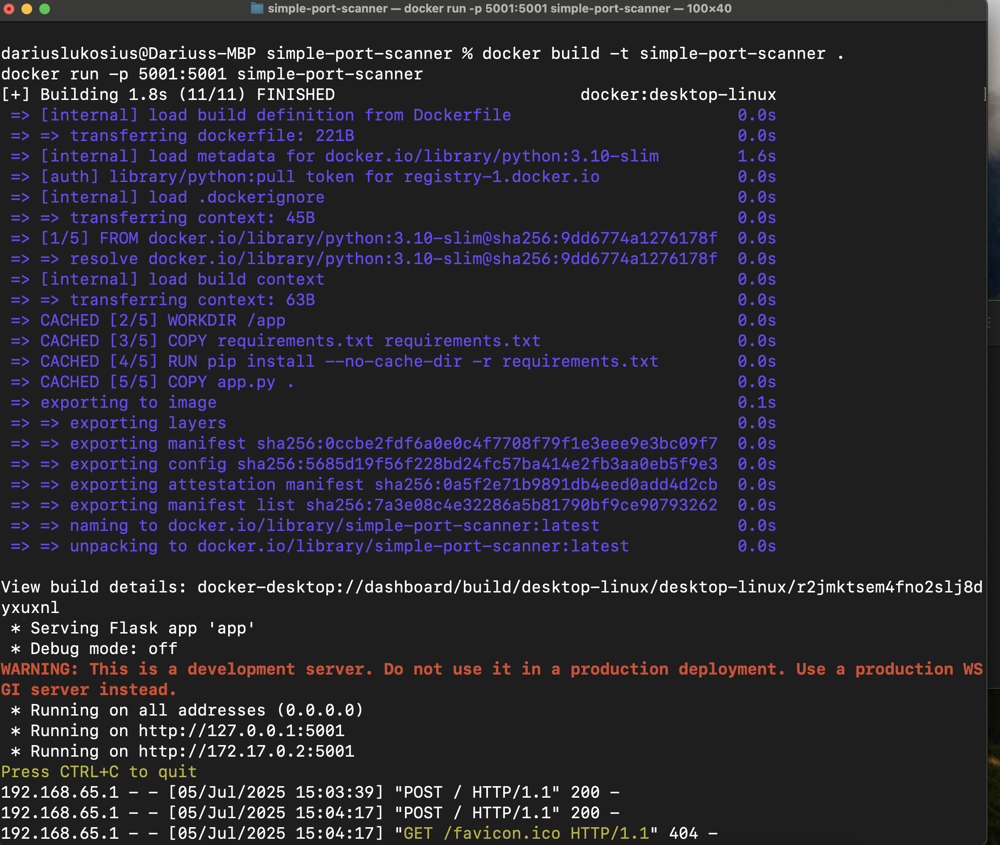
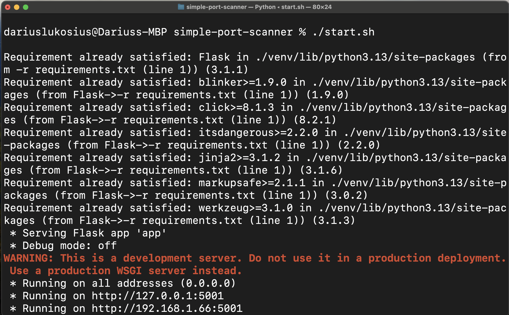

============================
        Simple Port Scanner
============================

APRAŠYMAS
---------
Simple Port Scanner – minimalistinė Python Flask aplikacija, skirta TCP portų skenavimui nurodytam tinklo adresui. 
Programėlė leidžia per paprastą web sąsają įvesti tikslinį IP adresą arba domeną bei portų diapazoną ir patikrina, kurie portai yra atidaryti.

Projektas taip pat demonstruoja, kaip sukurti Flask aplikaciją, ją konteinerizuoti naudojant Docker ir paleisti izoliuotoje aplinkoje.

FUNKCIONALUMAS
--------------
- TCP portų skenavimas pagal vartotojo įvestus portų diapazonus
- Rezultatai pateikiami aiškioje web sąsajoje
- Flask pagrindu sukurta lengvai suprantama aplikacija
- Docker konteineris paprastam paleidimui ir diegimui

TECHNOLOGIJOS
-------------
- Python 3
- Flask web framework
- Docker (konteinerizavimui)

----------------------------------------------------

PALEIDIMO BŪDAI
---------------
Galima paleisti 3 būdais – pasirink tau patogiausią.

⚠️ Pastaba: Pirmiausia nusiklonavus repozitoriją privaloma įeiti į projekto katalogą:
cd simple-port-scanner

📦 PALEIDIMO BŪDAI:

1. Docker – alternatyva

   

-----------------------
Jei turi Docker, tai pats paprasčiausias būdas paleisti:

    docker build -t simple-port-scanner .
    docker run -p 5001:5001 simple-port-scanner

Tuomet eik naršyklėje į: http://localhost:5001

2. Lokalus paleidimas su Python (Unix/macOS) – alternatyva

   
----------------------------------------------------------
Atidaryk terminalą projekto kataloge.

Paleisk start skriptą:

    ./start.sh

Jei neturi start.sh, sukurk jį su šiuo turiniu:

    #!/bin/bash
    python3 -m venv venv
    source venv/bin/activate
    pip install -r requirements.txt
    python app.py

Eik į naršyklę ir atsidaryk: http://localhost:5001

3. Lokalus paleidimas su Python (Windows) – alternatyva
-------------------------------------------------------
Atidaryk komandų eilutę projekto kataloge.

Paleisk start.bat failą:

    start.bat

Jei neturi start.bat, sukurk jį su šiuo turiniu:

    python -m venv venv
    venv\Scripts\activate
    pip install -r requirements.txt
    python app.py
    pause

Eik į naršyklę ir atsidaryk: http://localhost:5001

